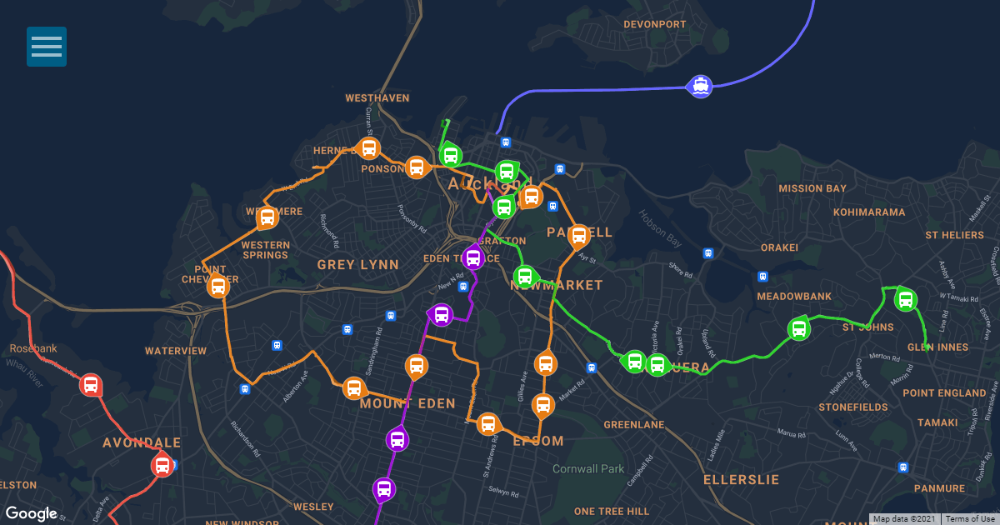

# Commute.live

[Commute.live](https://commute.live) provides real-time tracking for buses, trains and ferries.

## Packages

This monorepo consists of:

- [`@commutelive/backend`](./packages/backend/) is the main backend of Commute.live, which aggregates static and realtime data from multiple sources and exposes it via an API.
- [`@commutelive/backend-docker-manager`](./packages/backend-docker-manager/) is deployed on the server to automatically update the backend with zero downtime.
- [`@commutelive/common`](./packages/common/) contains shared types and functions.
- [`@commutelive/web`](./packages/web/) is the main frontend of Commute.live, which provides a user-friendly interface to view vehicles on one or more public transport routes.

## Acknowledgements

Commute.live is grateful for the data and services provided by the following organisations:

- VCS & CI/CD powered by [GitHub](https://github.com/)
- Transit information from [Transport for NSW](https://opendata.transport.nsw.gov.au/) / [CC BY](https://creativecommons.org/licenses/by/4.0/)
- Transit information from [Auckland Transport](https://at.govt.nz/about-us/at-data-sources/) / [CC BY](https://creativecommons.org/licenses/by/4.0/)
- IP geolocation by [DB-IP](https://db-ip.com) / [CC BY](https://creativecommons.org/licenses/by/4.0/)
